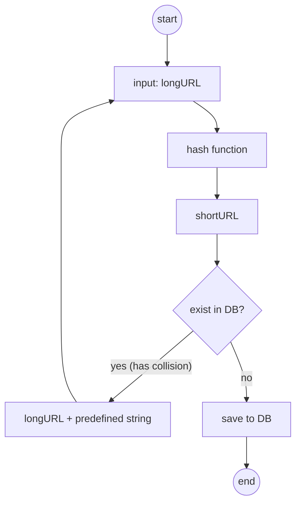

# 01 URL Shortener

## Requirements
- Shorten a long URL to a short link.
- Redirect from short link to original long URL.
- Support high availability and scalability.

## Data Model
- URL Mapping (short_id -> long_url)

## System Design

## Implementation Details
- Using Redis for caching/storing hot links.
- Postgres or similar for persistence.
