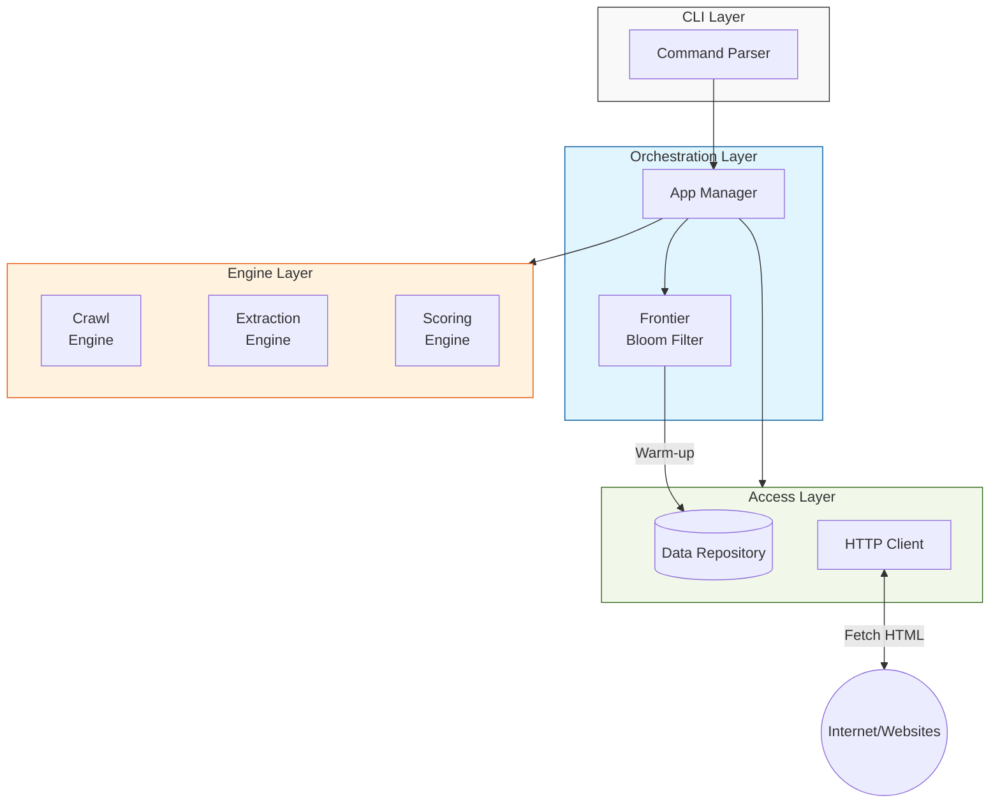
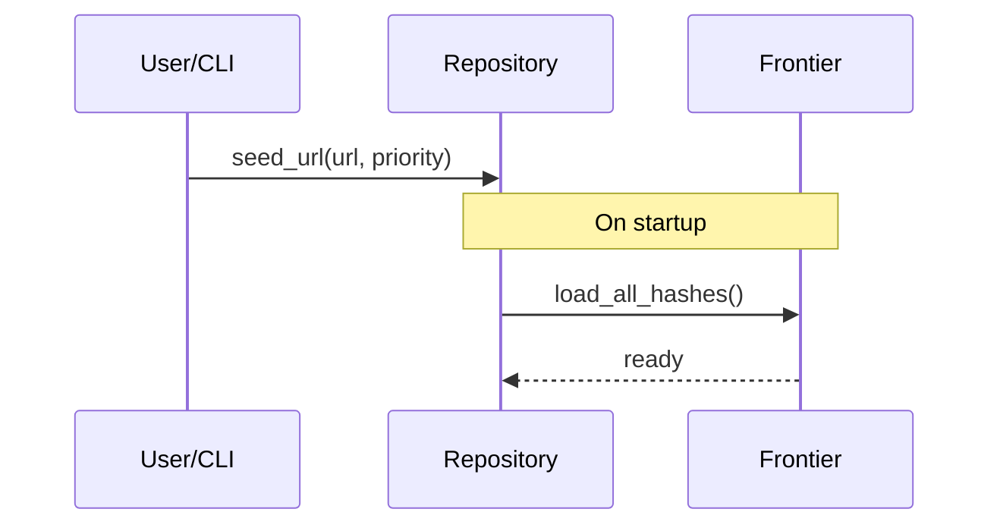
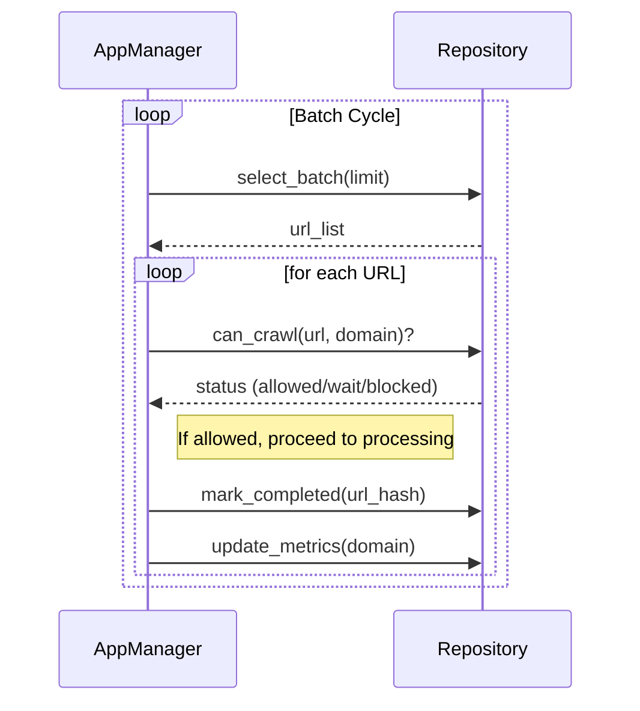
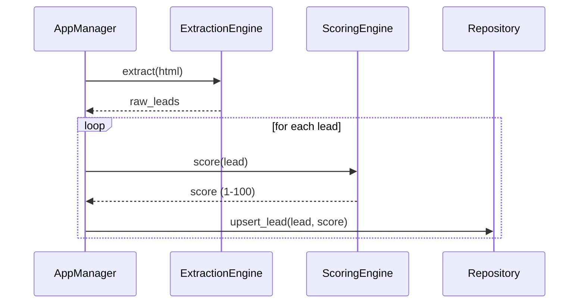
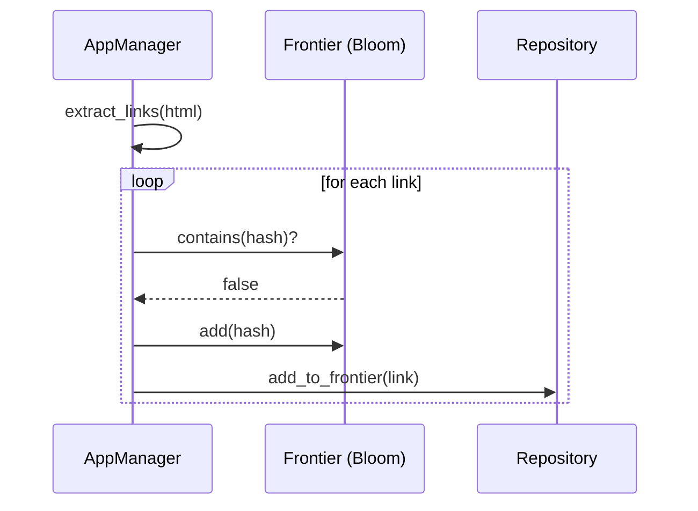

# 02 Prospect Web Crawler

A high-performance, modular web crawler built with Rust, designed for lead generation and automated discovery with a focus on politeness and intelligent scoring.

## Architecture

This project employs a highly modular architecture using traits to allow for pluggable crawl, extraction, and scoring strategies:

1.  **Engine Layer (`AppManager`)**: The central orchestrator that coordinates the crawl lifecycle. It manages the flow from URL selection to fetching, extraction, scoring, and persistence.
2.  **Strategy Engines**:
    *   **Crawl Engine**: Determines URL selection priority (e.g., `LeadFocusedEngine` vs. `DiscoveryEngine`).
    *   **Extraction Engine**: Parses HTML to find leads and new links (e.g., `RegexExtractor` vs. `SelectorExtractor`).
    *   **Scoring Engine**: Evaluates the quality of extracted data (e.g., `WealthIntentScorer` vs. `ProfessionalReferralScorer`).
3.  **Frontier Management**:
    *   **Frontier**: An in-memory/database hybrid queue that uses a **Bloom Filter** for high-efficiency URL deduplication before hitting the database.
    *   **Politeness**: Integrated `robots.txt` compliance that automatically fetches, caches (24h), and respects site-specific rules (`Allow`/`Disallow`) and dynamic `Crawl-delay` directives using a native port of Google's parsing library.
4.  **Data Access Layer (`repository`)**:
    *   **PostgreSQL**: Stores the URL frontier, extracted leads, and domain metrics using SQLx.

## System Architecture

The crawler uses a layered approach with trait-based dependency injection to decouple business logic from infrastructure.



### Operational Workflows

#### 1. Seed & Warm-up
This workflow handles the initial entry of URLs into the system and prepares the application for high-performance deduplication. When the app starts, it "warms up" the Bloom Filter by loading all previously crawled URL hashes from the database into memory.
*   **Outcome**: The crawler has a verified starting point and is ready to instantly filter millions of duplicate links without hitting the database.



#### 2. Batch Orchestration & Politeness
The orchestrator manages the high-level crawl loop, selecting batches of work and enforcing "politeness" to avoid overwhelming target servers. It checks domain-specific metrics (like crawl delays and error rates) and evaluates `robots.txt` rules before allowing a fetch to proceed.
*   **Outcome**: A coordinated stream of URLs that are safe to crawl, ensuring the bot is a polite citizen by strictly adhering to `robots.txt` specifications and server-enforced delays.



#### 3. Lead Value Pipeline
This workflow highlights the primary business value: transforming raw HTML into scored and prioritized leads. It demonstrates how the pluggable extraction and scoring engines work together to qualify discovered data.
*   **Outcome**: High-quality leads are saved to the database with intent scores, providing immediate business value from the crawl.



#### 4. Link Discovery
This workflow covers the recursive expansion of the crawl frontier. It uses the Bloom Filter for instant, high-efficiency deduplication to ensure the crawler never visits the same URL twice.
*   **Outcome**: The system discovers unique new URLs and expands the frontier without redundant processing.



## Tech Stack

- **Language**: [Rust](https://www.rust-lang.org/) (Edition 2024)
- **Database**: [PostgreSQL](https://www.postgresql.org/) (SQLx)
- **Async Runtime**: [Tokio](https://tokio.rs/)
- **HTTP Client**: [Reqwest](https://github.com/seanmonstar/reqwest)
- **HTML Parsing**: [Scraper](https://github.com/causal-agent/scraper)
- **Robots.txt Parser**: [robotstxt](https://github.com/pizlonator/robotstxt-rs) (Native port of Google's C++ library)
- **Deduplication**: [Bloom Filter](https://github.com/crepererum/bloomfilter-rs)
- **CLI Framework**: [Argh](https://github.com/google/argh)
- **Logging**: [Tracing](https://github.com/tokio-rs/tracing)

## Getting Started

### Prerequisites
- Docker and Docker Compose
- Rust toolchain (v1.85+)
- [Just](https://github.com/casey/just) task runner

### Running the Project

The easiest way to start the required infrastructure is using the provided `just` commands.

1.  **Start dependencies** (PostgreSQL):
    ```powershell
    just dev
    ```
3.  **Run tests**:
    ```powershell
    just test
    ```

## Usage

The crawler exposes a CLI which you can interact with via `cargo run --`.

### Seed URLs
This command adds a website link to the database so the crawler knows it needs to be visited. It assigns a priority number to the link which tells the system which websites to check first. The link is stored in the frontier table until the crawl command is run.
```powershell
cargo run -- seed "https://example.com" --priority 5
```

### Execute Crawl
This command starts the automated process of visiting websites and saving information. It downloads the HTML code from a website, looks for specific data like contact info, and saves any new links it finds back into the database. You can choose different settings to change how the bot picks sites and how it finds information.
```powershell
# Options: --engine [lead|discovery], --extractor [regex|selector], --scorer [wealth|referral]
cargo run -- crawl --engine lead --extractor regex --scorer wealth --batch 5
```

### View Discovered Leads
This command pulls the saved information out of the database and shows it to you on the screen. It displays the data that was found, like names or websites, along with a quality score calculated by the bot. You can limit the list to show only a certain number of the most recent or highest-scored results.
```powershell
cargo run -- leads --limit 50
```
