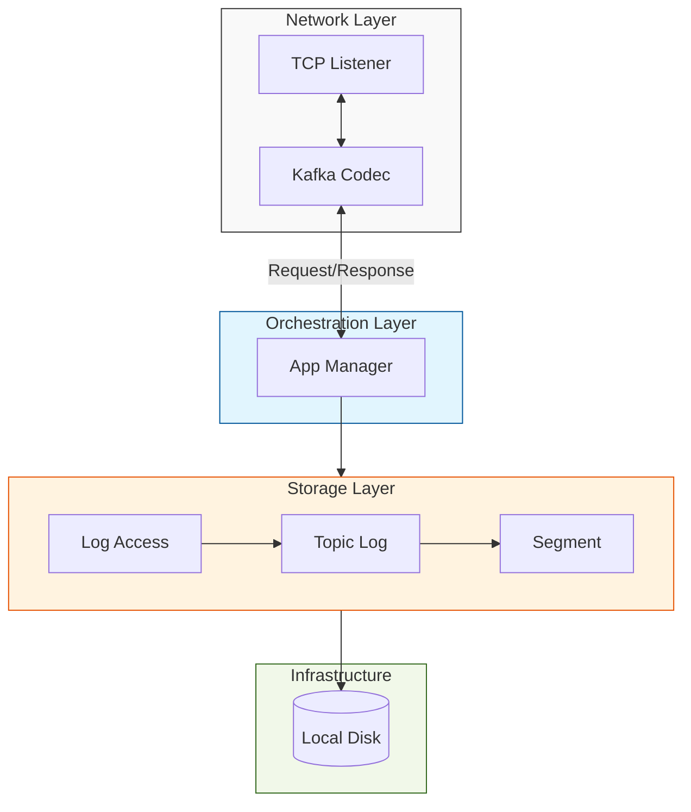
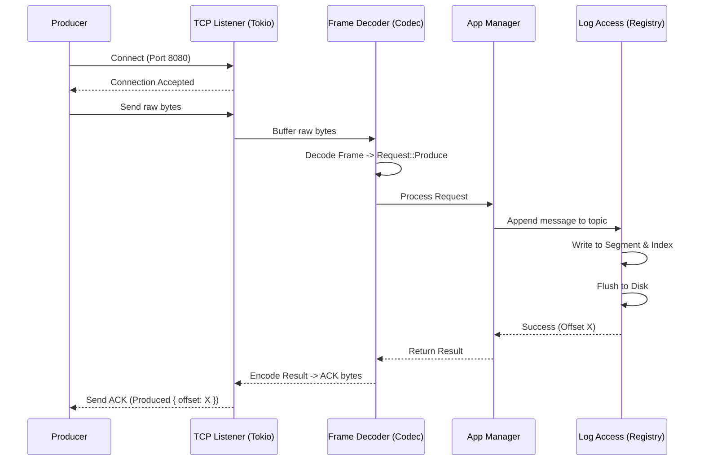

# 03 Kafka-lite

A high-performance, lightweight message broker implementation in Rust, designed to demonstrate core distributed systems concepts like append-only logs, binary protocols, and concurrent I/O.

## Architecture

Kafka-lite follows a decoupled, service-oriented architecture designed for high throughput and reliability.

1.  **Network Layer (`codec.rs`)**: Built with `tokio-util::codec`, this layer handles raw TCP streams. It uses a custom length-prefixed binary framing protocol and **Bincode** for efficient serialization/deserialization of requests and responses.
2.  **Service Layer (`manager/app_manager.rs`)**: The `AppManager` acts as the broker's "brain," routing decoded requests to the storage layer and enforcing business rules (e.g., topic name validation via Regex).
3.  **Storage Layer (`access/`)**: A sophisticated, multi-level append-only storage system:
    *   **Registry (`registry.rs`)**: Manages the lifecycle and discovery of multiple topics.
    *   **Topic Log (`topic_log.rs`)**: Handles log rotation and segment management for individual topics.
    *   **Segment (`segment.rs`)**: The foundation of the storage engine. Each segment consists of a `.log` file (actual data) and a `.index` file (offset-to-position mapping), utilizing **CRC32** for data integrity.

## System Architecture

The broker uses a layered approach with dedicated components for networking, logic orchestration, and storage management.



### Data Ingestion Flow (Producer Push)
The ingestion layer focuses on safely committing messages to disk and acknowledging them as quickly as possible.



### Storage Structure
Kafka-lite organizes data on disk using a directory-per-topic structure with segmented log files.

```text
data/
└── my_topic/
    ├── 00000000000000000000.log    # Raw message data + CRC
    ├── 00000000000000000000.index  # [Offset, Position] pairs
    ├── 00000000000000000124.log    # New segment after rotation
    └── 00000000000000000124.index
```

## Tech Stack

- **Language**: [Rust](https://www.rust-lang.org/) (Edition 2024)
- **Async Runtime**: [Tokio](https://tokio.rs/)
- **Serialization**: [Bincode](https://github.com/bincode-org/bincode)
- **I/O Utilities**: [Bytes](https://github.com/tokio-rs/bytes) & [tokio-util](https://github.com/tokio-rs/tokio-util)
- **Integrity**: [CRC32fast](https://github.com/srijs/rust-crc32fast)
- **Configuration**: [config-rs](https://github.com/mehcode/config-rs) (YAML + Env support)
- **Logging**: [Tracing](https://github.com/tokio-rs/tracing)

## Getting Started

### Prerequisites
- [Rust](https://www.rust-lang.org/tools/install) (Edition 2024)
- [Just](https://github.com/casey/just) (optional, for task automation)
- Docker & Docker Compose (optional, for containerized deployment)

### Running Locally
1. Build the project:
   ```powershell
   just build
   ```
2. Run the broker:
   ```powershell
   cargo run
   ```
   The broker will start on `127.0.0.1:8080` by default (configurable in `config.yaml`).

### Running with Docker
To run the broker in a containerized environment:
```powershell
just docker-up
```
Data is stored internally within the container at `/data` for this learning version.

## Usage

Kafka-lite uses a binary protocol. While you cannot use `curl` directly, you can interact with it using the provided integration tests as a reference or by building a simple client using the `Request` and `Response` enums in `lib.rs`.

### Protocol Example (Conceptual)
Messages are sent as: `[4-byte Length][Bincode Payload]`

**Produce Request:**
```rust
let request = Request::Produce {
    topic: "alerts".to_string(),
    message: b"Critical system error".to_vec(),
};
```

**Fetch Request:**
```rust
let request = Request::Fetch {
    topic: "alerts".to_string(),
    offset: 0,
};
```

### Testing
Verify the implementation with the suite of unit and integration tests:
```powershell
just test
```
