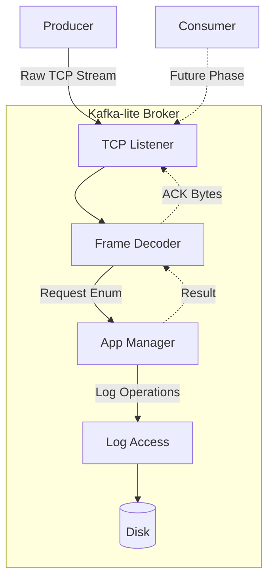
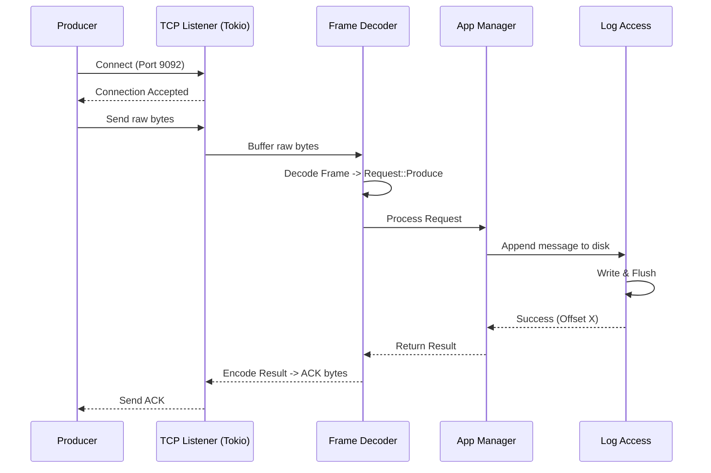
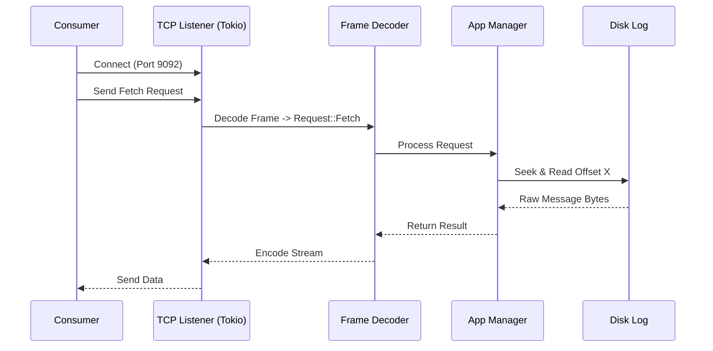

# Kafka-lite Development Plan (Phase 1: Ingestion Layer)

## Project Overview
This phase focuses strictly on the "front door" of Kafka-lite: how the broker listens for, receives, and initially stores incoming data from producers. Before we tackle distributed consumer groups or complex offset tracking, we must first build a robust, high-throughput network layer capable of accepting custom binary payloads over TCP and appending them to a fundamental storage log.

## Technical Stack
- **Language:** **Rust** (leveraging `tokio` for high-performance asynchronous networking).
- **Network Protocol:** Raw TCP sockets with custom binary framing (length-prefixed).
- **Storage (Initial):** Basic append-only file operations using `tokio::fs` or standard `std::fs`.

## Phases of Development

### Phase 1: Research & Discovery
- **Tokio & Async Rust:** Review `tokio::net::TcpListener` and `tokio::io` for handling concurrent connections efficiently.
- **Binary Protocols & Serde:** Investigate using `bytes` crate for efficient buffer management and `bincode` or manual bit-manipulation for binary framing.
- **Sequential Disk I/O:** Research Rust's file handling performance and how to ensure thread-safe appends to a shared log file.

### Phase 2: Architecture & Design
- **Async TCP Server:** Design an asynchronous loop that accepts connections and spawns a new task for each client.
- **Protocol Data Unit (PDU):** Design a simple binary message structure. Example: `[4-byte Message Length] [4-byte Checksum] [N-byte Payload]`.
- **The Append Log Abstraction:** Design a `LogAccess` struct that manages a file handle and provides a synchronized `append` method.
- **Service-Based App Manager:** Use a centralized `AppManager` to decouple the Network Layer from the Core Logic.

### Phase 3: Implementation Steps
- **Task 1: TCP Listener (Tokio):** Implement a `tokio` based TCP server that listens on a port (e.g., 9092) and logs basic connection events.
- **Task 2: Binary Framing & `BytesCodec`:** Implement a frame decoder (using `tokio_util::codec`) to handle TCP stream fragmentation and reconstruct messages from the wire.
- **Task 3: Rust-based Producer CLI:** Create a small companion CLI tool in the same project that can connect and push a test binary payload.
- **Task 4: The Append-Only Log:** Implement a thread-safe `Log` struct that uses an `Arc<Mutex<File>>` or similar pattern to ensure sequential, non-corrupted writes.
- **Task 5: Server Acknowledgement (ACK):** Modify the server to send a success byte back to the producer once the message is flushed to disk.

### Phase 4: Testing & Quality Assurance
- **Unit Tests:** Test the codec with partial byte buffers to ensure the state machine handles fragmentation correctly.
- **Integration Tests:** Use `tokio::test` to spin up a server and producer in-memory to verify end-to-end data flow.
- **Throughput Test:** Benchmarking with a high-volume producer to measure messages-per-second written to disk.

## Potential Challenges
- **Ownership & Concurrency:** Managing file handles across multiple async tasks in Rust (handled via `Arc` or dedicated writer tasks).
- **TCP Stream Fragmentation:** Ensuring the codec doesn't hang or leak memory if a producer sends invalid or incomplete headers.
- **Disk Latency:** Ensuring that waiting for disk sync doesn't block the network thread (using `spawn_blocking` or async file operations).

---

## Clean Architecture & The Service Layer
To ensure the `AppManager` remains protocol-agnostic, we will implement it as a core service.

- **Core Domain:** Defines agnostic `Request` and `Response` enums (e.g., `Request::Produce`).
- **Network Layer:** Handles TCP connections and translates raw bytes into these enums.
- **App Manager:** A centralized service that receives requests, performs disk I/O via the `LogAccess` layer, and returns results.

This decoupling allows us to test the business logic independently of the network and makes it easy to add different protocols (HTTP/gRPC) later.

---

## Diagrams

### 1. Application Components

### 2. Receiving Messages (Producer Push)

### 3. Giving Messages to Consumers (Simple Example)

---

## Phase 1 Progress Tracker

### Research & Discovery
- [x] Tokio & Async Rust
- [x] Binary Protocols & Serde (Bincode selected)
- [x] Sequential Disk I/O Research

### Architecture & Design
- [x] Async TCP Server Skeleton
- [x] Protocol Data Unit (PDU) Design
- [x] Service-Based App Manager Design
- [x] Log Access Layer Design (See `log_access_plan.md`)

### Implementation Steps
- [x] **Task 1:** TCP Listener (Tokio)
- [x] **Task 2:** Binary Framing & `KafkaCodec`
- [x] **Task 3:** Add config.yaml configuration
- [x] **Task 4:** The Log Access Layer (Refactored into segment, topic_log, and registry)
- [x] **Task 5:** Server Acknowledgement (ACK)

### Testing & Quality Assurance
- [x] Codec Unit Tests (Fragmentation & Safety Limits)
- [x] Integration Tests (End-to-end Producer -> Broker)
- [ ] Throughput/Stress Tests
